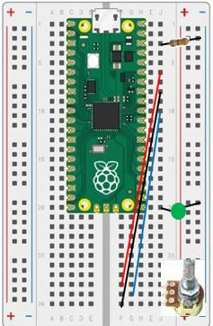

# Our Fifth Lab: Using an Analog to Digital Converter (ADC) 

## Parts for this Lab are in Bag **2** and Bag **5**

1. We need a single LED for this lab from bag 2.  As a reminder for the setup:

    ```Insert the Anode(+) lead into j20```

    ```Insert the Cathode(-) lead into the Ground(-) rail```

    ```Insert the resistor leads into j3 and into the Ground(-) rail``` 

1. We will also use one of the potentiometers from Bag 5.

    - Insert the pins of the potentiometer into ```j30, j28, and j26```
    - Using one of the jumper wires in Bag 5, insert one end to ```f30``` and the other end into the ```j8``` 
    - Take the second jumper wire, insert one end into the ```g28``` and the other into ```j10```
    - Using the third jumper wire, insert one end into ```f26``` and the other end into ```j6```

1. When you are finished, your breadboard should look similar to the image below (Note: your LED and wires may be different colors)



## What is Analog to Digital Conversion (ADC)?

The Pico has the ability to convert an analog voltage (a voltage anywhere between 0 and ADC_REF volts) to a corresponding digital (0 to 65535) reading.  We can then use that potentiometer to vary the input to one of the ADC pins by turning the knob clockwise and counter clockwise.

Note the use of the special voltage pins (ADC_REF and AGND): The supply voltage is filtered, since we want to exclude ripples due to the chip’s internal clock.

The object of this lab is to have the external LED start out on.  Then, slowly dim the LED using the potentiometer.  Once the LED is off, slowly bring it back to full brightness.  Continue until you stop the program.

- Reading from the ADC pin is accomplished by:
    ```python
    from machine import Pin, ADC
    potentiometer = ADC(Pin(26))
    data = potentiometer.read_u16()
    ```

!!! Challenge
    Now that we know how to read data from the potentiometer via the built-in analog to digital converter, we want to use that data to vary the brightness of the LED.

    Remember that the brightness of the LED can be set by changing the duty cycle of the pulse width modulation, just like we did in the previous lab.

     - Don't forget to comment your code!
     
