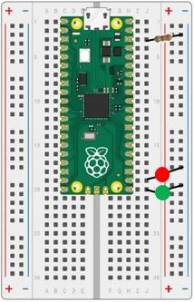

# Our Second Lab: Using the Digital I/O Pins to Make Two LEDs Blink

## Parts for this Lab are in Bag **2**

1. The longer lead on the LED is the Anode(+) lead.  This is the lead that you will connect to your Pico

    ```Insert the Anode leads into j20 and j19```

1. The shorter lead on the LED is called the Cathode(-).  This is the lead that you will connect to the ground rail.

    ```Insert the Cathode leads into the Ground(-) rail```

1. We will also use a resistor from one of the ground pins on the Pico and connect it to the ground rail.

    ```Insert the resistor leads into j3 and into the Ground(-) rail``` 

1. When you are finished, your breadboard should look similar to the image below (Note: your LEDs may be different colors)



## How Would You Make the LEDs Blink in an Alternating Pattern?

The object of this lab is to have one of the external LEDs on while the other is off.  Then switch after one second.  Continue until you stop the program.

- We can modify the first program to use two GP pins to control the external LEDs.  
- Hints: 
    - Look at the Raspberry Pi Pico diagram and find the GP pins connected to ```J20 and J19```.
    - Start with one GP on (high) and the other off (low)
    - Use the toggle function to turn each LED on and off

!!! Challenge
    Can you add the other two LEDs in the bag and have one LED on a time?  Ideally, each LED would be on for one second while the rest were off, then the next LED would turn on, and so on.
    
    Think about some of the lessons you learned in the Python Class!  Here are some ideas:

    - Use a list to hold the GPIO pins (led1, led2, led3, led4)

    - Use a loop to determine which LED to turn on

    - Use a function to turn on one LED will turning the others off

     - Don't forget to comment your code!
     