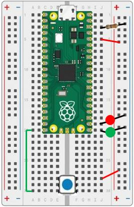

# Our Third Lab Continued: Reading a Button Press (Interrupt)

## Parts for this Lab are in Bag **2** and Bag **3**

1. Using the setup from the last lab, we'll use two LEDs and a resistor from Bag 2.  As a reminder:

    ```Insert the Anode (long) leads into j20 and j19```

    ```Insert the Cathode (short) leads into the Ground(-) rail```

    ```Insert the resistor leads into j3 and into the Ground(-) rail``` 

1. We will also use the parts from Bag 3.  As a reminder:

    - The pins of the switch will straddle the channel and be inserted into ```e28, e30, f28, and f30```
    - Using one of the jumper wires in Bag 3, insert one end to ```j5``` and the other end into the ```Power(+) rail``` 
    - Take the second jumper wire, insert one end into the ```Power(+) rail``` and the other into ```j28```
    - Using the third jumper wire, insert one end into ```a30``` and the other end into ```a20```
    - When you are finished, your breadboard should look similar to the image below (Note: your LEDs and wires may be different colors)



## What is an Interrupt and Why Would You Use It?

- Although the polling version is simple, it does take a lot of the processor resources. The button.value() is checked multiple times a second, even though the button might only be pressed once a day.

- A more efficient strategy is to use an interrupt handler.  This is a function that is “registered” by MicroPython to handle external events such as button pushes.

- Think of it like this: instead of checking your phone every 10 seconds, waiting for a text from your friend, your phone vibrates to let you know you have a text.

## How Would You Read the Button Using an Interrupt?

The object of this lab is still to have one of the external LEDs on while the other is off.  Then switch after each button press.  Continue until you stop the program.

- We can use the third program to continue to use two GP pins to control the external LEDs.  
- We will still use pin 15 to be an input, with the default state to be logical 0 (pulled down):
    - button = Pin(15, Pin.IN, Pin.PULL_DOWN)
- This is where the program will change, an interrupt handler has two parts:
    - The function that handles the interrupt:
    ```python
    def buttonPressed(pin):
        global lastTime, led1, led2
        
        # get the time the button was pressed and compare it with the last time
        newTime = utime.ticks_ms()
        if newTime - lastTime > 200:
            led1.toggle()
            led2.toggle()
            lastTime = newTime    
    ```
    - And register the function for the interrupt:
    ```python
    button.irq(trigger=Pin.IRQ_FALLING, handler=buttonPressed)
    ```
- Finally, the program loop is just a call to the sleep function, since the interrupt handler will handle any button press
- Save your program as lab3a.py
- Don't forget to comment your code!
