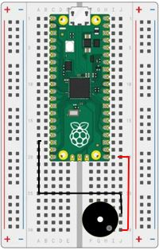

# Our Tenth Lab: Using a Buzzer with PWM 

## Parts for this Lab are in Bag **10**

1. Place the buzzer from Bag 10 with the positive pin (marked with a plus sign) in  ```h30```
1. The other pin should line up into ```f28```
1. Using one of the jumper wires in Bag 10, insert one end to ```j30``` and the other end into ```j20```
1. Using one of the jumper wires in Bag 10, insert one end to ```j28``` and the other end into ```a18```

1. When you are finished, your breadboard should look similar to the image below (Note: your wires may be different colors)



## Using a Buzzer to Make a Sound

- We already know how to use PWM to make an LED glow brighter or dimmer.

- We can use the same PWM principal to make a sound with a piezo buzzer.

!!! Challenge
    - Using what you learned in the previous labs, do the following:
        - Set up GP 16 as a PWM pin
        - Set the frequency to 1,000 Hz
        - Set the duty cycle to 50%
        - Wait 5 seconds 
        - Then set the duty cycle to 0 to turn off the sound
        - Don't forget to comment your code!
     
