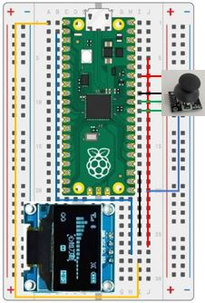

# Our Ninth Lab: Using a Joystick to Draw Lines on an SSD1306 Digital Display 

## Parts for this Lab are in Bag **8**, with the addition of the Joystick

1. Using the setup from the last lab, we'll use the display from Bag 8.  As a reminder:

    - Insert the display into ```f25, f26, f27, and f28```
    - Using one of the jumper wires in Bag 8, insert one end to ```i25``` and the other end into ```i18```
    - Using another jumper wire from Bag 8, insert one end to ```j26``` and the other end into ```j5```
    - Using another jumper wire from Bag 8, insert one end to ```h27``` and the other end into ```b2```
    - Using another jumper wire from Bag 8, insert one end to ```i28``` and the other end into ```a1```

1. Using the wires attached to the joystick, connect them as follows:
    - The wire from **GND** on the joystick goes to ```i8```
    - The wire from **+5V** on the joystick goes to ```i6```
    - The wire from **VRX** on the joystick goes to ```i9```
    - The wire from **VRY** on the joystick goes to ```i10```
    - The wire from **SW** on the joystick goes to ```j20```

1. When you are finished, your breadboard should look similar to the image below (Note: your wires may be different colors)



## Drawing Lines With a Joystick and the SSD1306 Display

- We already added the SSD1306 library to the Pico.

- We also took some time to look at the methods in the SSD1306 library.
    - Did you notice the line method?
    - The line method is called as follows:
        ```python
        # Draw a line from X1, Y1 to X2, Y2 with pixels turned on
        display.line(x1, y1, x2, y2, 1)
        ```

- We learned how to read the Analog to Digital Converter inputs in Lab 5.  In this case, we are using two of the ADCs.

- Additionally, we learned to read a button press in Lab 3.  We do not need to use the interrupt method (although we could)

!!! Challenge
    - Using what you learned in the previous labs, do the following:
        - Give the user instructions on how to operate the joystick to clear the screen
        - Wait for the user to press the joystick
        - Clear the screen
        - Read the voltages from the joystick 
        - Convert the voltages to a screen coordinate (X, Y)
        - Draw a line from the starting position to the new position
        - Continue until the user clears the screen
        - Don't forget to comment your code!
     
     - Hint:
     You will need this formula to scale the voltage to a position
    ```python
    # Takes an input number value and a range between low-and-high and returns it scaled to the new range
    def scaled(value, istart, istop, ostart, ostop):
        return int(ostart + (ostop - ostart) * ((int(value) - istart) / (istop - istart)))
    ```
