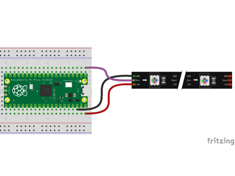
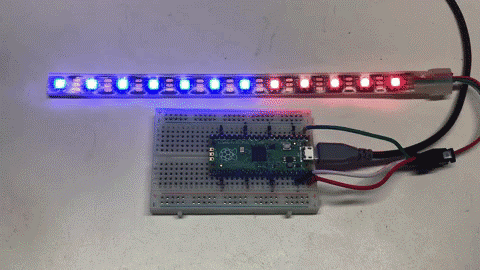

# Our Seventh Lab: Using a NeoPixel Display 

## Parts for this Lab are in Bag **7**

1. We will use the neopixel display from Bag 7.

    - Insert the lead from **GND** of the display into ```j3```
    - Insert the lead from **VCC** of the display into ```j40```
    - Insert the lead from **IN** of the display into ```a1```

1. When you are finished, your breadboard should look similar to the image below (Note: your wires may be different colors)



## Working With the NeoPixel Display

- NeoPixels are Red-Green-Blue LEDs that are designed to makes them easy to control with three wires: GND, +5V and a single serial data line.

- Controlling NeoPixels is challenging since the timing of data being sent must be very precise. Python alone is not fast enough to send bits out of a serial port. So a small function that uses assembly code is used. This code can be called directly from a neopixel driver library so that the user's don't need to see this code.

- Working with the display and the library
    - Import Pin and NeoPixel from their libraries
        ```python
        from machine import Pin
        from neopixel import NeoPixel
        ```
    - Define the number of pixels, the output pin, and intialize the NeoPixel class
        ```python
        NUMBER_PIXELS = 8
        LED_PIN = 0

        pin = Pin(LED_PIN, Pin.OUT) 
        strip = NeoPixel(pin, NUMBER_PIXELS)
        ```
    - Finally, you can set any of the pixels either one at a time
        ```python
        for i in range(0, NUMBER_PIXELS): 
	        strip [i] = (0,0,255) 
	        strip.write()
        ```
    - Or, you can set all of the pixels at the same time
        ```python
        strip.fill(0,0,255) 
	    strip.write()
        ```

!!! Challenge
    Using a variety of colors, set the pixels, one at time to each color such that it appears that the display starts out with a single pixel lit in a color, then two pixels in the same color, etc. until all 8 are lit.  Then start on a second color lighting the first pixel.

    

    Colors can be found here: 
    [https://www.rapidtables.com/web/color/RGB_Color.html](https://www.rapidtables.com/web/color/RGB_Color.html)

    Once that works, turn the entire set of pixels on with a single color, then move to the next color that you selected.

     - Don't forget to comment your code!
     
