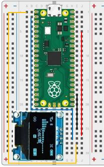

# Our Eigth Lab: Using an SSD1306 Digital Display 

## Parts for this Lab are in Bag **8**

1. We will use the SSD1306 display from Bag 8.

    - Insert the display into ```f25, f26, f27, and f28```

1. Using one of the jumper wires in Bag 8, insert one end to ```i25``` and the other end into ```i18```

1. Using another jumper wire from Bag 8, insert one end to ```j26``` and the other end into ```j5```

1. Using another jumper wire from Bag 8, insert one end to ```h27``` and the other end into ```b2```

1. Using another jumper wire from Bag 8, insert one end to ```i28``` and the other end into ```a1```

1. When you are finished, your breadboard should look similar to the image below (Note: your wires may be different colors)



## Working With the SSD1306 Display

- We'll need to add the SSD1306 Library to our Pico.  This can be done through Thonny.  Use the ```Tools->Manage Packages...``` menu to add the Micropython library.
    

- Our display uses an Inter-Integrated Circuit (I2C) interface.  The I2C interface was first developed by Phillips Semiconductor in 1982 to facilitate serial communication between devices.  Our display supports 400 kbit transfer rates.  You'll see this in the I2C method definition.

- Working with the display and the library
    - Import Pin, I2C and SSD1306_I2C from their libraries
        ```python
        from machine import Pin, I2C
        from ssd1306 import SSD1306_I2C
        ```
    - Intialize the I2C and SSD1306 classes
        ```python
        # Initialize the I2C interface:
        #    Use the Pico I2C 0 interface
        #    Serial Data will use GP0
        #    Serial Clock will use GP1
        #    Transfer rate will be 400,000
        i2c = I2C(0, sda=Pin(0), scl=Pin(1), freq=400000)

        # Our display is 128 pixels wide, 64 pixels high, and uses the I2C interface
        display = SSD1306_I2C(128, 64, i2c)
        ```
    - Finally, you can use the following commands
        ```python
        # Clear the display by turning all pixels off (0) or on (1)
        display.fill(0)
        
        # Write some test to the framebuffer at the top left of the display
        display.text("Hello World", 0, 0)

        # Move the framebuffer to the display
        display.show()
        ```

!!! Challenge
    - Start by writing your name to the display at the top left corner.
    - Pause for a quarter of a second
    - Move your name down and to the right
    - Pause again
    - Continue moving down and to the right until you get tothe bottom or the right edge of the screen. 
    - If you hit the right edge, start moving left until you hit the left edge
    - If you hit the bottom edge, start moving until you hit the top edge
    - Don't forget to comment your code!

    - Explore other commands in the display library by typing in the shell:
        ```python
        from ssd1306 import SSD1306_I2C
        print(dir(SSD1306_I2C))
        ```
     
