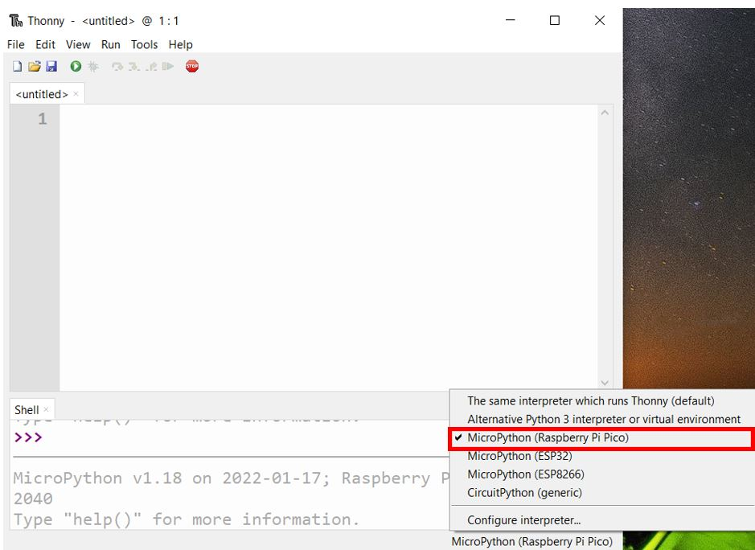
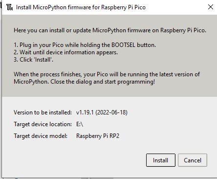
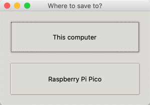

# Thonny Python IDE
A lightweight Python integrated development environment (IDE) that is ideal for beginners writing simple Python programs for first time users.  It has been modified to work well with the Raspberry Pi Pico.  It supports different ways of stepping through the code, step-by-step expression evaluation, detailed visualization of the call stack and a mode for explaining the concepts of references and heap.

Thonny 3.3.3 (2021-01-21) was the first version to support the Raspberry Pi Pico.  There have also been several enhancements since that release.  For a release history see the [Thonny Release History](https://github.com/thonny/thonny/blob/master/CHANGELOG.rst).  We suggest checking this link monthly for updates.

## Installing Thonny

The best way to install Thonny is to go to the Thonny web site and look for the "Download" for your opeating system.  That link is here:

[https://thonny.org/](https://thonny.org/)

Make sure you upgrade to the latest version of Thonny if you already have Thonny installed on your computer.

You can find more tips on getting started with Thonny on the Raspberry Pi website:

[https://projects.raspberrypi.org/en/projects/getting-started-with-the-pico/2](https://projects.raspberrypi.org/en/projects/getting-started-with-the-pico/2)

### Working with MicroPython on the Raspberry Pi Pico

Once Thonny is successfully installed, make sure to change the interpreter that Thonny runs to MicroPython for the Raspberry Pi Pico.  This is done by changing the selected interpreter on the bottom right of the Thonny screen.



Thonny runs on Mac, Windows and Linux.

### Installing MicroPython

- Hold down the boot button on the board (white button)

- Plug one end of the USB cable into the board and the other end into your computer

-  The Pico should show up as a new drive (labeled RPI-RP2) available on your computer

- Thonny will install the latest version of MicroPython for you



#### Running help()
You can enter the help() function in the main script area and then press the Play button.  This will tell you 

```
MicroPython v1.14 on 2021-02-02; Raspberry Pi Pico with RP2040
Type "help()" for more information.
>>> %Run -c $EDITOR_CONTENT
Welcome to MicroPython!

For online help please visit https://micropython.org/help/.

For access to the hardware use the 'machine' module.  RP2 specific commands
are in the 'rp2' module.

Quick overview of some objects:
  machine.Pin(pin) -- get a pin, eg machine.Pin(0)
  machine.Pin(pin, m, [p]) -- get a pin and configure it for IO mode m, pull mode p
    methods: init(..), value([v]), high(), low(), irq(handler)
  machine.ADC(pin) -- make an analog object from a pin
    methods: read_u16()
  machine.PWM(pin) -- make a PWM object from a pin
    methods: deinit(), freq([f]), duty_u16([d]), duty_ns([d])
  machine.I2C(id) -- create an I2C object (id=0,1)
    methods: readfrom(addr, buf, stop=True), writeto(addr, buf, stop=True)
             readfrom_mem(addr, memaddr, arg), writeto_mem(addr, memaddr, arg)
  machine.SPI(id, baudrate=1000000) -- create an SPI object (id=0,1)
    methods: read(nbytes, write=0x00), write(buf), write_readinto(wr_buf, rd_buf)
  machine.Timer(freq, callback) -- create a software timer object
    eg: machine.Timer(freq=1, callback=lambda t:print(t))

Pins are numbered 0-29, and 26-29 have ADC capabilities
Pin IO modes are: Pin.IN, Pin.OUT, Pin.ALT
Pin pull modes are: Pin.PULL_UP, Pin.PULL_DOWN

Useful control commands:
  CTRL-C -- interrupt a running program
  CTRL-D -- on a blank line, do a soft reset of the board
  CTRL-E -- on a blank line, enter paste mode

For further help on a specific object, type help(obj)
For a list of available modules, type help('modules')
>>> 
```
## Save Options
You can save a python file in Thonny to either the Pico or to your local computer's file system.



first stop execution of any program you are running.

## Version
After you press play the following will appear in the console.

```sh
MicroPython v1.13-290-g556ae7914 on 2021-01-21; Raspberry Pi Pico with RP2040
Type "help()" for more information.
>>> %Run -c $EDITOR_CONTENT
```

## Background on Thonny

MicroPython was originally developed by Damien George and first released in 2014.  However, MicroPython did not have a development environment that was easy for students to use.  Thonny was developed to provide an easy to use tool just for MicroPython development.  Thonney was created at the [University of Tartu Institute of Computer Science](https://www.cs.ut.ee/en) in Estonia for this purpose.  They continue to support Thonny.

Several feature for Thonny were sponsored by the [Raspberry Pi Foundation](glossary#raspberry-pi-foundation) and we continue to see a close relationship between the Raspberry Pi Foundation and the Thonny development team.

* [Thonny web site](https://thonny.org/)