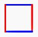

## Test Equvalence

Condition | Test | Example
----------|------|--------
Equals | a == b | 2 + 3 == 5
Not Equals | a != b | 2 + 2 ! = 5
Less Than | a < b | 2 < 5
Less Than or Equal | a <= b | 2 + 2 <= 5
Greater Than | a > b | 5 > 2
Greater Than or Equal | a >= b | 5 > 2 + 2
Contains | a in b | 'a' in 'awesome'

## Logical Conditionals
Condition | Expression | Explanation | Example
----------|------------|-------------| -------
And | a and b | Both must be true | a == b and c == d
Or | a or b | Either must be true | a == b or c == d
Not | a not in b | a is not contained in b | 'a' not in 'Antique'

## When are Conditionals Used?

- In an if statement:
```python
if i > j:
   print(str(i) + ' is greater than ' + str(j))
elif i == j:
   print(str(i) + ' is equal to ' + str(j))
else:
   print(str(i) + ' is less than ' + str(j))
```

- In a while loop:
```python
i = 0
while (i < 10):
   print(i)
   i += 1
```

!!! Challenge
   Can you create a square where two parallel sides are blue and the other two parallel sides are red?

   <center></center>