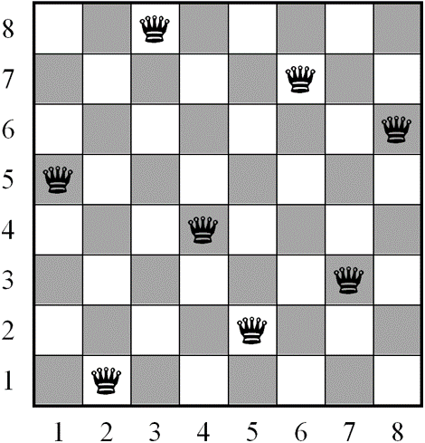

## A harder problem

Try solving the Eight Queens Problem: Place eight queens on a chessboard such that they cannot attack each other.

Here is a possible answer to the problem:

Image from: https://www.researchgate.net/figure/a-A-solution-to-the-non-attacking-8-queens-problem-b-An-optimal-solution-to-the_fig1_278681097

Don't give up too quickly!

If you need help, here is a solution: [https://trinket.io/library/trinkets/cedd39c32c](https://trinket.io/library/trinkets/cedd39c32c)