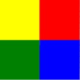

!!! Challenge

Using what you have learned, can you draw four squares in different colors, then hide the turtle when the drawing is complete?

## Some hints

1. Import the turtle library
1. Set the variables for distance and angle
    - distance = 40
    - angle = 90
1. Set the color of the turtle
    - jet.color("green")
1. Start the file area
    - jet.begin_fill()
1.  Draw a square, but _don't_ do the last turn
1. End the file area
    - jet.end_fill()
1. Repeat steps 3 through 6 until all four squares are drawn
1. Hide the Turtle
    - jet.hideturtle()

Four Squares: [https://trinket.io/python/a7e1bf623c](https://trinket.io/python/a7e1bf623c)

