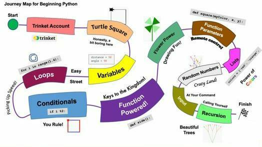

# 
Introduction - Python Journey Map

Credit: Dan McCreary and CoderDojoTC

The map above is a visual guide to our Introduction to Python course. Students start their journey in the upper left corner at the green start circle. They then journey through each of the lessons until they reach the finish line. 