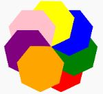

## A Simple List

Besides numbers and text, variables can contain a collection of items called a list

- For example
    - a collection (list) of colors: colors = ['green', 'blue', 'red', 'yellow']
- Once we create a list, we can use it in a _for_ loop as follows:

```python
colors = ['green', 'blue', 'red', 'yellow']
for color in colors:
    jet.color(color)

    # Draw a square
```

- The full code can be found here: [https://trinket.io/python/94de1feac8](https://trinket.io/python/94de1feac8)

## What Else Can We Do With a List?

Let's start with a list: colors = ['green', 'blue', 'red', 'yellow']

Operation | Result
----------| ------
colors.append('green') | colors = ['green', 'blue', 'red', 'yellow“, 'green']
colors.insert(2, 'green') | colors = ['green', 'blue', 'green', 'red', 'yellow“, 'green']
colors.remove('green') | colors = ['blue', 'green', 'red', 'yellow“, 'green']
color = colors.pop(2) | color = 'red', colors = ['blue', 'green', 'yellow', 'green']
color = colors.pop() | color = 'green', colors = ['blue', 'green', 'yellow']
colors.sort() | colors = ['blue', 'green', 'yellow']
colors.reverse() | colors = ['yellow', 'green', 'blue']
colors.clear() | colors = []

## Taking It a Step Further

- Find the number of elements in a list:

```python
colors = ['green', 'blue', 'red', 'yellow']
number = len(colors)
print(number)
```

!!! Challenge
1. Get a random number of colors from the user
    1. hint: color = input('Enter a color: ')
1. Store the color in a list of colors
1. Draw the polygons, one in each color, in a similar manner to the four squares.
    1. Let the number of sides of each polygon be equal to the number of colors that the user entered
        1. hint: # of sides = len(colors)
    1. Calculate the angle needed to draw a polygon
        1. hint: angle = 360 / # of sides
    1. Loop through all of the colors in the list you created
        1. hint: 
        ```python
        for color in colors:
            # set the color
            # begin fill
            # draw polygon
            # end fill
        # hide the turtle when done.
        ```
<center></center>

Need some help?  Take a look here: [https://trinket.io/python/06ab63c75f](https://trinket.io/python/06ab63c75f)

What happens if the user only enters two colors?  Can you add a check?