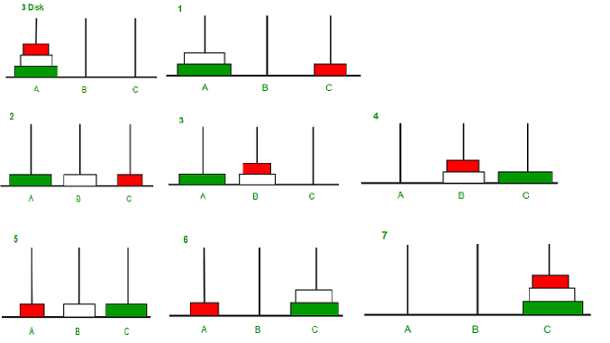

## A recursive problem

The Towers of Hanoi is a classic problem to solve with recursion.  There are three towers.  The first tower has a set of rings, starting at the bottom with the largest ring, and moving up to a smaller ring at ech new level, until we get to the top.  The object is to move the rings from the left most tower, where the rings start, to the right most stack, always making sure that a smaller ring is above a larger ring.

## Example

Here is an example, using a tower with three rings:

Image from: https://www.geeksforgeeks.org/c-program-for-tower-of-hanoi/

## The Steps

1. Disk 1 moved from A to C 
1. Disk 2 moved from A to B 
1. Disk 1 moved from C to B 
1. Disk 3 moved from A to C 
1. Disk 1 moved from B to A 
1. Disk 2 moved from B to C 
1. Disk 1 moved from A to C 

!!! Challenge

    Can you write a recursive program to solve the towers of hanoi?

    To solve the problem, you will need to do the following:

    1. Define a function that takes in the number of discs and the three poles (stacks) as arguments. This function will be used to move the discs from one pole to another.

    2. Use a recursive approach to move the discs from the starting pole to the final pole, using the auxiliary pole as a temporary storage.

    3. To move a disc, you will need to first move all the discs that are on top of it to the auxiliary pole, using the same function.

    4. Once all the discs on top of the current disc have been moved, you can move the disc to the final pole.
    
    5. Repeat this process until all the discs have been moved from the starting pole to the final pole.

A solution: [https://trinket.io/python/d425c2e31e](https://trinket.io/python/d425c2e31e)
