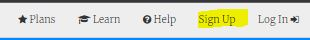
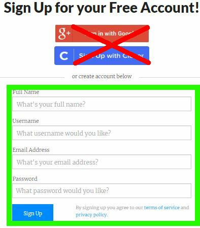
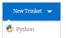

# Getting Started With Trinket

These labs assume that you have internet access and a modern web browser such as Chrome.

We'll use the [Trinket web site](https://trinket.io/) because it a student-safe place that has many of the basic turtle drawing libraries implemented in and easy-to-use web environment.  It is appropriate for students just getting started with python programming.  The free version meets all the needs of our beginning python class.

## What can you do on Trinket?

1. You can save programs
1. You can share programs
1. You can (re)name programs
1. You can create folders of programs
1. You can run/debug your program
1. You can make the program fill the screen (fullscreen)
1. Download your Python code

## Using Trinket

* Go to the [Trinket web site](https://trinket.io/)
    * Sign up by clicking on the Sign Up area in the right navigation area
    
    * Create your account by entering the following:
        * Your name
        * A username
        * Your email (use your school email)
        * A password (Don't use your school password!)
    
    * Create a new python trinket
        * Click on the Blue "New Trinket" button
        * Select "Python"
        
    
