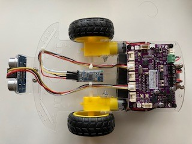
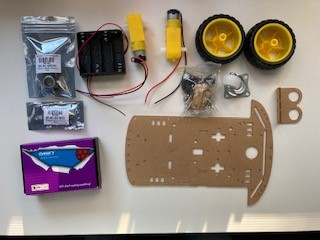
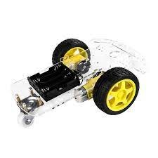
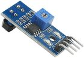
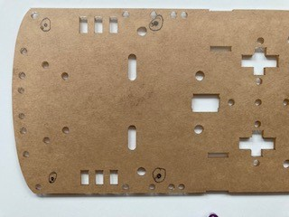
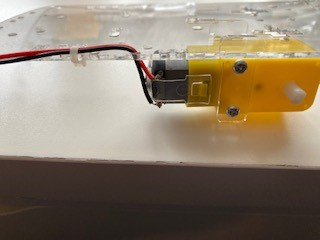
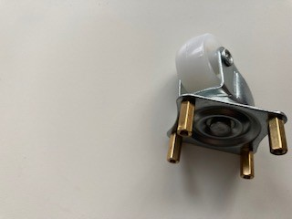
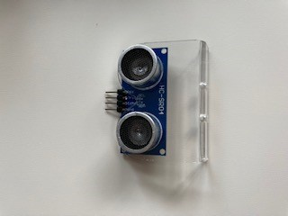

# Building a remote control robot car with the Maker Pi RP2040


This was the robot car that is built using the parts kit as descriped below.

The bot brain is the Maker Pi RP2040.  The Maker Pi board makes building a bot simple, since it is a one board solution built around the RP2040 (the same controller used in the Raspberry Pi Pico).  The board comes with a dual channel DC motor driver, four servo motor ports, seven grove ports, a piezo, and two multi color leds. 

[Maker Pi RP2040 Information](https://www.cytron.io/p-maker-pi-rp2040-simplifying-robotics-with-raspberry-pi-rp2040)

 **The parts kit includes:**

 

 Description | Part 
---------|----------
Chassis kit | 
Maker Pi RP2040 | 
HC-05 or AT-09 Bluetooth module | 
Ultrasonic sensor and mount | 

Additional parts (not included in the kit):

- Nuts, bolts, and spacers
- Wire ties to secure wires
- Four AA batteries
- USB Micro B Cable
- Two optional IR Sensors for line following 

 **Additional software required:**

- An IDE capable of supporting MicroPython, for example: [Thonny](https://thonny.org/)
- Software capable of connecting to and writing to the bluetooth module, for example: LightBlue, available in the iOS & Google Play app stores

**There are several parts to this project.  Let's break them down by tasks:**

- Remove the default CircuitPython run-time
- Install the MicroPython run-time
- Communicate with the bluetooth module
- Get data from the ultrasonic sensor
- Assemble the chassis 
- Putting it all together

**Remove the default CircuitPython run-time**

The Maker Pi RP2040 comes with the CircuitPython run-time. The first step is to remove CycuitPython with the run-time flash_nuke available [here](https://www.raspberrypi.org/documentation/pico/getting-started/static/6f6f31460c258138bd33cc96ddd76b91/flash_nuke.uf2)

Download the flash_nuke.utf file to your local machine.  With the switch in the off position on the board, connect the board to your computer via the USB cable.  Press and hold the BOOT button (button closest to the Grove 1 port), then turn on the power.  This will make the board look like a USB drive. You can then just drag the flash_nuke.utf file onto the drive and the board will be initialized. Make sure to power the board off and back on without pressing the BOOT button.

**Install the MicroPython run-time**

Download the MicroPython run-tme, available [here](https://micropython.org/download/rp2-pico/rp2-pico-latest.uf2)

Once again, turn off the board, hold down the BOOT button, and turn on the board.  You should see the board show up as a USB drive again.  Drag the new utf file over to the drive, turn the power off, and turn it back on without pressing the BOOT button.  The MicroPython run-time should now be loaded onto your board.

Assuming you are using the Thonny IDE, you should be able to configure the application to use the Raspberry Pi Pico MicroPython interface.  When you are done, press the Stop/Reset button and you should see the MicroPython RPEL prompt identifying the version of MicroPython running on your board.

**Communicate with the bluetooth module**

The bluetooth modules communicate at 9600 baud by default, although some older modules use 115200 baud.  Communication is done through the built in UART on the board.  The settings (baud rate, name, etc.) can be changed by sending AT commands to the module.  Sending "AT+HELP" to the module will return a list of supported commands.

The AT commands for getting/setting baud rate are:

Send | Receive | Parameter
---------|----------|---------
 AT+BAUD? | OK+Get:[P1] | P1: Baud Rate
 AT+BAUD[P1] | OK+Set:[P1] | 0: 9600; 1: 19200; 2: 38400
 . |  | 3: 57600; 4: 115200; 5: 4800
 . |  | 6: 2400; 7: 1200; 8: 230400
 . |  | Default: 0 (9600)

The pins are usually labelled on the back of the module.  Your module with either have six or four pins.  Ignoring the outer most pins (assuming your module has six pins), the pins from left to right as you look at the back of the board are VCC (3.3 VDC), Gnd, Tx, & Rx.  Connect the grove connector wires as follows:

Wire Color | Module Pin
---------|----------
Red | VCC
Black | GND
Yellow | TXD
White | RXD

Connect the other end of the grove wire harness to the grove 3 port.  Using the following code and your bluetooth application of choice, you should be able to send data to the board and have it display in the terminal window.

N.B.: If you are using an Apple device to communicate with the bluetooth module, you must use the AT-09 module.  Apple does not support the HC-05 bluetooth version.

This is the code:
```python
from machine import Pin, UART

# Get the data from the UART
def readUartBytes(uart):
    resp = b""
    while uart.any():
        resp = b"".join([resp, uart.read(1)])
    return resp.decode()
 
# Create the UART
uart0 = UART(1, baudrate=9600, tx=Pin(4), rx=Pin(5))

# Loop
while True:
    data = str(readUartBytes(uart0)) 
    if data != "":
        print(data)
```
**Get data from the ultrasonic sensor**

The ultrasonic sensor measures distance using sonar, an ultrasonic (well above human hearing) pulse (~40KHz) is transmitted from the unit and distance-to-target is determined by measuring the time required for the echo return.  The pins are labeled on the front of the module - Vcc  (3.3 VDC), Trig, Echo, and Gnd.

Connect the grove connector wires as follows:

Wire Color | Sensor Pin
---------|----------
Red | Vcc
White | Trig
Yellow | Echo
Black | Gnd

Connect the other end of the grove wire harness to the grove 5 port.  Once connected, wave your hand over the sensor and have it display distance in the terminal window.  For our purposes, we'll convert the measurement to inches.

The code is below

```python
from machine import Pin
import utime
import time

# Using Grove 5 Connector
TRIGGER_PIN = 6 # White Wire
ECHO_PIN = 26 # Yellow Wire

# Init HC-SR04P pins
trigger = Pin(TRIGGER_PIN, Pin.OUT) # send trigger out to sensor
echo = Pin(ECHO_PIN, Pin.IN) # get the delay interval back

def ping():
    trigger.low()
    utime.sleep_us(2) # Wait 2 microseconds low
    trigger.high()
    utime.sleep_us(5) # Stay high for 5 microseconds
    trigger.low()
    while echo.value() == 0:
        signaloff = utime.ticks_us()
    while echo.value() == 1:
        signalon = utime.ticks_us()
    timepassed = signalon - signaloff
    distance = (timepassed * 0.0343) / 2
    return distance * .254

while True:
    print("Distance:", ping(), "inches")
    utime.sleep(.25)
```

**Assemble the chassis**



Place the Maker PI RP2040 board on the rear of the chassis as shown and mark the small holes that are in each corner.  Make sure the back of the board is closer to the back of the chassis, since the motors will end up close to the front board mounts.


Once the holes are marked, drill the holes, using an 1/8 inch drill bit.  Be careful, as your mounting holes may be close to existing mount holes in the chassis.  Also note that the chassis is thin plastic, so it must be supported as you drill through it.


After the holes are drilled, remove the paper from the chassis, motor mounts, and sensor mount.  All parts should be clear plastic after the paper is romoved.



Gather the wheel, motor, mounts, long screws, and nut as shown above.  Slide the motor mounts through the chassis, then insert and secure the motor with the screws.  Note that the wires will seperate from the motor if not handled with care.  The wires should be on the side of the motor that faces out from the chassis.  Once the motor is mounted, feed the wires through the chassis and optionally secure them with a wire tie.


Add the wheel once the motor is mounted and repeat for the other side.


The battery holder is mounted on the bottom of the chassis, nestled between the motors.  The wires from the battery holder should feed to the rear of the chassis.



Assemble the rear wheel by adding the standoffs to the castor wheel as shown in the above left image.  Then attach it to the chassis.  The wires for the battery holder are shown feeding through the hole to the left of the motor wires.  They will need to be fed through the right side (assembler error).


Feed the screws up through the bottom of the chassis in the holes that were drilled.  Use the plastic spacers to separate the board from the chassis (and clear the wires), then secure the board with the nuts.  The board should be mounted such that the connections to the motor and battery wires face the rear of the chassis.  The wires can now be trimmed and attached to the board.  Carefully note that the black battery wire connects to the negative (-) green terminal and the red battery wire attaches to the positive (+) green terminal.  The motor wires should connect to the black terminals, with the black wires on the outside (terminals labeled GP8 and GP 11) and the red wires on the inside (terminals labeled GP 9 and GP 10).



Insert the ultrasonic sensor in the mount with the pins up (it will appear as if the sensor is mounted upside down, well it is).  Then attach the mount to the front of the chassis with the short screws.  Disconnect the wires from the sensor (assuming they are still attached from previous testing) and thread the wires from the grove 5 port through the chassis and back to the sensor.  Use a small wire tie to keep the wires secure.


The bluetooth module will nestle between the wire ties used to tidy up the wires.  Disconnect the wires from the bluetooth module and thread the wires from the grove 3 port through the chassis and reconnect to the module as shown.  This completes the chassis assembly.

**Putting it all together**

Now that all the individual parts have been assembled and tested, the final code is below.  Note that the control wiring for the motors may be different for you.  You may have to adjust in order for your robot car to move as desired. Run the code from your IDE to test functionality before saving it to the board.  You should be able to connect to the bluetooth module to send commands as shown below:

Command | Direction
---------|----------
h | halt (stop the wheels)
f | forward fast (both wheels spin clockwise)
s | forward slow (both wheels spin clockwise)
l | turn left (right wheel spins clockwise, left wheel spins counter clockwise)
r | turn right (right wheel spins counter clockwise, left wheel spins clockwise)

- Add additional code to make the bot run backwards (fast or slow) on command.

Additionally, you should be able to wave your hand in front of the ultrasonic sensor and see the wheels slow, reverse, and turn.

 _Add batteries, download the code to the board as main.py, and Happy motoring!_


```python
from machine import Pin, PWM, UART
import utime
import time
from neopixel import NeoPixel

NUMBER_PIXELS = 2
LED_PIN = 18

#Define the pin as output
pin = Pin(LED_PIN, Pin.OUT)

# Define the NeoPixel Strip
strip = NeoPixel(pin, NUMBER_PIXELS)

# Color RGB values
red = (255, 0, 0)
yellow = (255, 150, 0)
green = (0, 255, 0)
black = (0, 0, 0)
startColors = (red, black, red, black, yellow, black, yellow, black, green, black, green, black)

def showColor(color):
    for i in range(NUMBER_PIXELS):
        strip[i] = color
    strip.write()

# Using Grove 5 Connector
TRIGGER_PIN = 6 # White Wire
ECHO_PIN = 26 # Yellow Wire

# Init HC-SR04P pins
trigger = Pin(TRIGGER_PIN, Pin.OUT) # send trigger out to sensor
echo = Pin(ECHO_PIN, Pin.IN) # get the delay interval back

def ping():
    trigger.low()
    utime.sleep_us(2) # Wait 2 microseconds low
    trigger.high()
    utime.sleep_us(5) # Stay high for 5 microseconds
    trigger.low()
    while echo.value() == 0:
        signaloff = utime.ticks_us()
    while echo.value() == 1:
        signalon = utime.ticks_us()
    timepassed = signalon - signaloff
    distance = (timepassed * 0.0343) / 2
    return distance * .254

BUZZER_PIN = 22
buzzer = PWM(Pin(BUZZER_PIN))

def playTone():
    buzzer.duty_u16(1000)
    buzzer.freq(150)

def stopTone():
    buzzer.duty_u16(0)
    
#define the UART
uart0 = UART(1, baudrate=9600, tx=Pin(4), rx=Pin(5))

# Get the data from the UART
def readUartBytes(uart):
    resp = b""
    while uart.any():
        resp = b"".join([resp, uart.read(1)])
    return resp.decode()

# Motor definitions
FULL_POWER_LEVEL = 65024
RIGHT_FORWARD_PIN = 11
RIGHT_REVERSE_PIN = 10
LEFT_FORWARD_PIN = 9
LEFT_REVERSE_PIN = 8

right_forward = PWM(Pin(RIGHT_FORWARD_PIN))
right_reverse = PWM(Pin(RIGHT_REVERSE_PIN))
left_forward = PWM(Pin(LEFT_FORWARD_PIN))
left_reverse = PWM(Pin(LEFT_REVERSE_PIN))

def forward():
    right_reverse.duty_u16(0)
    left_reverse.duty_u16(0)
    right_forward.duty_u16(FULL_POWER_LEVEL)
    left_forward.duty_u16(FULL_POWER_LEVEL)

def forwardSlow():
    right_reverse.duty_u16(0)
    left_reverse.duty_u16(0)
    right_forward.duty_u16(FULL_POWER_LEVEL // 2)
    left_forward.duty_u16(FULL_POWER_LEVEL // 2)

def reverse():
    right_forward.duty_u16(0)
    left_forward.duty_u16(0)
    right_reverse.duty_u16(FULL_POWER_LEVEL)
    left_reverse.duty_u16(FULL_POWER_LEVEL)
    
def reverseSlow():
    right_forward.duty_u16(0)
    left_forward.duty_u16(0)
    right_reverse.duty_u16(FULL_POWER_LEVEL // 2)
    left_reverse.duty_u16(FULL_POWER_LEVEL // 2)

def left():
    left_forward.duty_u16(0)
    right_reverse.duty_u16(0)
    left_reverse.duty_u16(FULL_POWER_LEVEL // 2)    
    right_forward.duty_u16(FULL_POWER_LEVEL // 2)
    
def right():
    right_forward.duty_u16(0)
    left_reverse.duty_u16(0)
    right_reverse.duty_u16(FULL_POWER_LEVEL // 2)    
    left_forward.duty_u16(FULL_POWER_LEVEL // 2)
    
def stop():
    right_forward.duty_u16(0)
    right_reverse.duty_u16(0)
    left_forward.duty_u16(0)
    left_reverse.duty_u16(0)

def reverseAndTurn():
    utime.sleep(.5)
    reverseSlow()
    utime.sleep(1.5)
    left_reverse.duty_u16(0)
    left_forward.duty_u16(FULL_POWER_LEVEL // 2)
    utime.sleep(.75)
    stop()
    utime.sleep(.25)
    stopTone()
    
auto = False;
autoPin = Pin(20, Pin.IN)
leftPin = Pin(7, Pin.IN)
rightPin = Pin(0, Pin.IN)
for i in range(20):
    if not autoPin.value():
        auto = True
        utime.sleep(.25)

for color in startColors:
    showColor(color)
    utime.sleep(.5)

while auto:
    if leftPin.value() and rightPin.value():
        stop()
    elif leftPin.value():
        left()
    elif rightPin.value():
        right()
    else:
        forwardSlow()

forward()      # Assume the way ahead is clear
color = green
while True:
    dir = readUartBytes(uart0) # read from the UART
    if dir == 'h':
        stop()
        color = red
    elif dir == 'f':
        forward()
        color = green
    elif dir == 'l':
        left()
        color = green
    elif dir == 'r':
        right()
        color = green
    distance = ping()  # Check the distance
    if distance < 5 or dir == 's':   # Obstruction ahead, slow down
        forwardSlow()
        color = yellow
    if distance < 2.5: # Obstruction too close, stop, and play tone
        stop()
        color = red
        playTone()
    showColor(color)
    if distance < 2.5:  # If we were too close, back up and turn
        reverseAndTurn()
        forward()
        color = green
```

**The instructions for using the line sensors are as follows**

Attach the sensors to the front of the chassis as shown


Red wire to VCC

Black wire to GND

White wite to DO

The left sensor should be connected to Grove 7 and the right sensor should be connected to Grove 1

To start the line following code, start with the power switch in the off position, hold down the GP20 button, turn on the power switch, 
wait until the board starts flashing red, then release the button and place the bot on the track.  You may need to adjust the sensitivity 
of the sensors such that it picks up the difference between the dark line and the light "track."  I use black electrical tape on white card 
stock paper for my track.     
