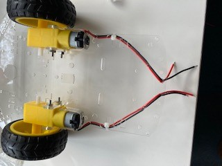
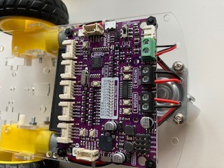

# Building a robot car with the Maker Pi RP2040

## The Robot Car Chassis Kit Assembly

### Start with the wheel and motor assembly

Gather the wheel, motor, mounts, long screws, and nuts as shown above.  Slide the motor mounts through the chassis, then insert and secure the motor with the screws.  Note that the wires will seperate from the motor if not handled with care.  The wires should be on the side of the motor that faces out from the chassis.  Once the motor is mounted, feed the wires through the chassis and optionally secure them with a wire tie.

Add the wheel once the motor is mounted and repeat for the other side.

### Add the battery holder

The battery holder is mounted on the bottom of the chassis, nestled between the motors.  Use the short screws and nuts to secure the battery holder to the chassis.  The wires from the battery holder should feed to the rear of the chassis.

### Next, add the rear wheel assembly

Assemble the rear wheel by adding the standoffs to the castor wheel as shown in the above left image.  Then attach it to the chassis.  The wires for the battery holder are shown feeding through the hole to the left of the motor wires.  They will need to be fed through the right side (assembler error).

### Finally, add the Maker Pi RP2040 board

Feed the screws up through the bottom of the chassis in the holes that were drilled.  Use the stand-offs to separate the board from the chassis (and clear the wires), then secure the board with the nuts.  The board should be mounted such that the connections to the motor and battery wires face the rear of the chassis.  The wires can now be trimmed and attached to the board.  Carefully note that the black battery wire connects to the negative (-) green terminal and the red battery wire attaches to the positive (+) green terminal.  The motor wires should connect to the black terminals, with the black wires on the outside (terminals labeled GP8 and GP 11) and the red wires on the inside (terminals labeled GP 9 and GP 10).

## About the Maker Pi RP2040

The robot car's brain is the Maker Pi RP2040.  The Maker Pi board makes building a robot simple, since it is a one board solution built around the RP2040 (the same controller used in the Raspberry Pi Pico).  The board comes with a dual channel DC motor driver to drive the wheels, four servo motor ports, seven grove ports for digital I/O, Indicator LEDs, a piezo, and two Neopixel leds.

[Maker Pi RP2040 Information](https://www.cytron.io/p-maker-pi-rp2040-simplifying-robotics-with-raspberry-pi-rp2040)
