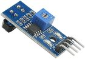
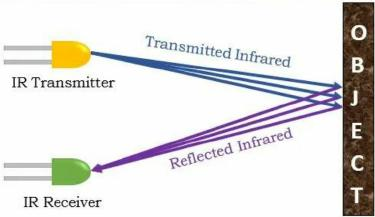
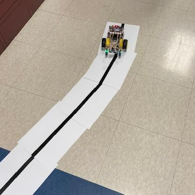

# Line Following

## Detecting Light and Dark



We are going to use the IR Sensors to detect the line that we want the cars to follow.

### Key Points About How an IR Sensor Works:



- Emitting infrared light: The sensor has a small LED that emits infrared light, which is invisible to the human eye.
- Reflection and Detection: When this infrared light hits an object, some of it is reflected back towards the sensor's receiver, which is a phototransistor sensitive to infrared radiation.
- Signal interpretation: The receiver converts the reflected infrared light into an electrical signal that can be interpreted by a microcontroller, indicating the presence of an object.

## Mounting and Connecting the Sensors

The sensors are mounted to the front of the car using the black screws. Use two grove connector wires (one for each sensor) to connect the sensors to the Maker Pi RP2040 board.  Connect the wires as follows:

Wire Color | Sensor Pin
---------|----------
Red | VCC
Black | GND
White | DO
Yellow | AO

The left sensor should be connected to Grove 7 and the right sensor should be connected to Grove 1.  Use wire ties as needed to dress the wires.  The sensitivity of the sensor is set using the small variable resistor on the top of the sensor.

## How to Read the Sensor

The DO pin of the sensor is a digital output that can be read by the Maker Pi RP2040 board.  The left sensor is connected to GP7 and the right sensor is connected to GP0.  We can detect the value of each of the sensors using the following code:

```python
leftSensor = Pin(7, Pin.IN)
rightSensor = Pin(0, Pin.IN)

leftIR = leftSensor.value()
rightIR = rightSensor.value()
```

!!! Challenge
    Using what you just learned, can you modify the main.py code so the car follows a line along a track?

    
