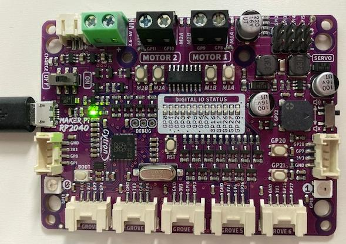
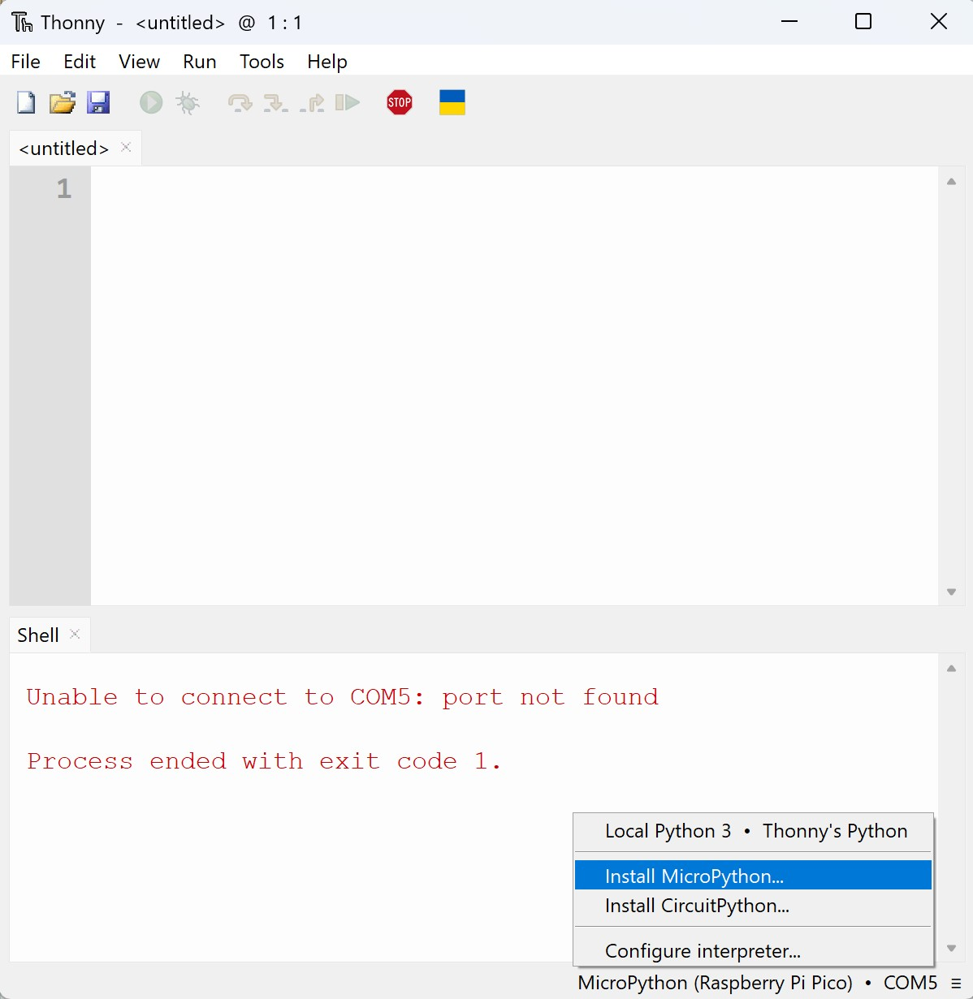
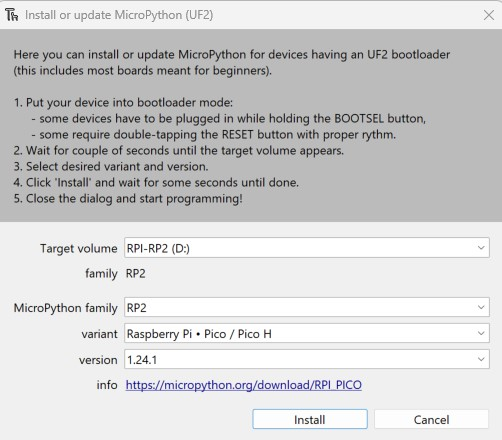
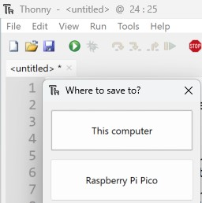

# Getting the Robot Car to Move

## Connect your Computer to the Maker Pi RP2040

Use the USB cable to connect your laptop to the Maker Pi RP2040.  Once connected, move the switch to the the ON position.  You should see the green light turn on.



## Loading the MicroPython interpreter onto the Maker Pi RP2040 using Thonny

Now that your board is connected, you need to download the MicroPython interpreter using the Thonny application.  Start Thonny, then select Install MicroPython... from the bottom right corner of the main window.



Select the Raspberry Pi Pico / Pico H from the variant pulldown and use the latest version.  Then click Install.



Close the Install window after the the install is done.  Click on the red STOP icon at the top of the main window once the install window closes.  You should see the latest version of MicroPython in the bottom window.

## Using Digital I/O

Our board has digital input and output ports.  They are either on or off.  You can see that by typing the following in the main window, then clicking on the GREEN icon.  You will see one of the wheels turn at full speed and then stop after 5 seconds:

```python
from machine import Pin
from time import sleep
wheel = Pin(11, Pin.OUT)
wheel.value(1)
sleep(5)
wheel.value(0)
```

## Using Pulse Width Modulation (PWM) to Control the Speed of the Motors

### PWM - How Does It Work?

- PWM is controlled by two factors:
    - How fast does the power turn on and off (frequency)
    - How long is the power on, relative to the power being off (duty cycle)

    

- We can declare that an output pin is a PWM pin as follows:

    ```python
    from machine import Pin, PWM
    from time import sleep

    pwmWheel = PWM(Pin(11))
    ```

- Now set the frequency and the duty cycle:

    ```python
    # Apply and remove power 1000 times/second (too fast to see)
    pwmWheel.freq(1000)

    # Apply voltage 25% of the time (Move at 1/4 speed) for 5 seconds
    # Range is 0 - 65535
    pwmWheel.duty_u16(16384)
    sleep(5)
    pwmWheel.duty_u16(0)
    ```

### Controlling the Motors

Now that we know some basic MicroPython, let's use it to control both of the motors.  We need some code to allow the Maker Pi RP2040 board to control each motor.  Notice that we need to define a seperate PWM Pin for each wheel, forward and backward:

```python
from machine import Pin, PWM
from time import sleep

# Motor definitions
right_forward = PWM(Pin(11))
right_forward.freq(1000)
right_reverse = PWM(Pin(10))
right_reverse.freq(1000)
left_forward = PWM(Pin(9))
left_forward.freq(1000)
left_reverse = PWM(Pin(8))
left_reverse.freq(1000)

# Wait 2 seconds before moving
sleep(2)

# Move Forward at half speed for 2 seconds
right_reverse.duty_u16(0)
left_reverse.duty_u16(0)
right_forward.duty_u16(32768)
left_forward.duty_u16(32768)
sleep(2)

# Move Backwards at half speed for 2 seconds
right_forward.duty_u16(0)
left_forward.duty_u16(0)
right_reverse.duty_u16(32768)
left_reverse.duty_u16(32768)
sleep(2)

# Stop Moving
right_forward.duty_u16(0)
right_reverse.duty_u16(0)
left_forward.duty_u16(0)
left_reverse.duty_u16(0)
```

## What's Next?

We need to install batteries and download code to the Maker PI RP2040 board in order to have the robot move on it's own.  Use Thonny's SAVE icon to save the code to the board by selecting Rasperry Pi Pico and saving the file as main.py.



!!! Challenge
    1. Can you have the robot autonomously drive in a straight line?

    2. Can you have the robot autonomously drive in a square and return to it's starting point?

        Note: The car will turn left or right when the wheels spin in the opposite directions.

