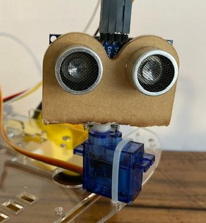

# Avoiding Obstacles with an Ultrasonic Sensor and a Servo

Now that we know how to stop when the car runs head on to an obstacle, what happens if we want to move around an obstacle or run the car on an obstacle course?

## Controlling Servo Motors


There are 4 dedicated connection points on the Maker Pi RP2040 board for connecting up servo motors. These motors have 3 wires: ground (brown), power (red), and signal (orange).  The board uses GP12, GP13, GP14,and GP15 are the dedicated pins for the servos.  We will use GP13 for our servo connection.  

## Installing the Micropython-servo Library

We can use a pre-existing library to control our servo.  We'll use Thony's Manage library tool to do so using the following steps:

### Click on Tools, then select manage libraries form the top navigation menu


### We want to use the micropython-servo library


### Select the library and install


## Using the Library

```python
from time import sleep
from servo import Servo

# According to the servo box, the pulse width range is 500usec to 2500 usec 
servo = Servo(pin_id=13, min_us=500.0,max_us=2500.0)
for degrees in range(0,180,5):
    servo.write(degrees)
    sleep(1)
```

## What's Next?

We need to remove the ultrasonic sensor and mount, and install the mount on the servo.

### Mounting the Sensor on the Servo

1.  Use a wire tie to secure the servo to the chassis.

2.  Use the short screw that comes with the servo to mount the "plus shaped" plastic to the servo.

3.  Finally, mount the sensor assemble to the "plus shaped" piece with the longer screws.



!!! Challenge
    Using what you just learned, can you modify the main.py code so the car turns away from an obstacle and continues straight ahead when unobstructed?
