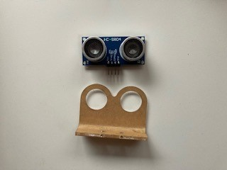

# Collision Avoidance with an Ultrasonic Sensor

The ultrasonic sensor measures distance using sonar, an ultrasonic (well above human hearing) pulse (~40KHz) is transmitted from the unit and distance-to-target is determined by measuring the time required for the echo return.  

## Mounting the Sensor

Find the ultrasonicsensor, mount, wire ties, grove connector wire, and screws in the box.  The sensor is in a bag labeled SN-HC-SR04P.  Use the silver screws.



Insert the ultrasonic sensor in the mount with the pins up (it will appear as if the sensor is mounted upside down, well it is).  Then attach the mount to the front of the chassis with the silver screws.  Thread the wires from the grove 5 port through the chassis and back to the sensor.  Use a small wire tie to keep the wires secure.

The pins are labeled on the front of the module - Vcc  (3.3 VDC), Trig, Echo, and Gnd.

Connect the grove connector wires to the sensor as follows:

Wire Color | Sensor Pin
---------|----------
Red | Vcc
White | Trig
Yellow | Echo
Black | Gnd

## A Brief Lesson on Conditionals

### Test Equvalence

Condition | Test | Example
----------|------|--------
Equals | a == b | 2 + 3 == 5
Not Equals | a != b | 2 + 2 ! = 5
Less Than | a < b | 2 < 5
Less Than or Equal | a <= b | 2 + 2 <= 5
Greater Than | a > b | 5 > 2
Greater Than or Equal | a >= b | 5 > 2 + 2

### Logical Conditionals

Condition | Expression | Explanation | Example
----------|------------|-------------| -------
And | a and b | Both must be true | a == b and c == d
Or | a or b | Either must be true | a == b or c == d

### When are Conditionals Used?

They are used when we want to test conditions in an if statement:

```python
if distance_cm > COLLISION DISTANCE_CM:
   forward(FULL_SPEED)
elif distance_cm <= COLLISION DISTANCE_CM and distance_cm > HALF_COLLISION_DISTANCE_CM:
   forward(HALF_SPEED)
else:
   stop()
```

## We Need a Library to use the Sensor

Use your browser and search for: Roberto Sánchez hcsr04.  Then select [micropython-hcsr04/hcsr0.py at master](https://github.com/rsc1975/micropython-hcsr04/blob/master/hcsr04.py) from the result list.

Copy the code from the page by clicking on the Raw icon


Paste the code into a Thonny window, then save it as hcsr04.py to the Maker Pi RP2040 board (use the Raspberry Pi Pico)

### Let's Test!

Open a new window in Thonny and type the following:

```python
from hcsr04 import HCSR04
from machine import Pin, PWM
from time import sleep

# Search for Roberto Sánchez hcsr04 to get the library

CHECK_DISTANCE_CM = 25

sensor = HCSR04(trigger_pin=6, echo_pin=26)
buzzer = PWM(Pin(22))
buzzer.freq(1000)
buzzer.duty_u16(0)

while True:
    distance_cm = sensor.distance_cm()
    if distance_cm < CHECK_DISTANCE_CM:
        buzzer.duty_u16(3500)
        sleep(.5)
    else: 
        buzzer.duty_u16(0)
```

### What's Happening?

Start the program.  Use your hand to move close to the sensor.  Do you hear the buzzer alert you that you are close to the sensor?  The code is calling the library you stored on the Maker Pi RP2040 board with the parameters that define the pins used to get a reading.  Next, we'll use the internal buzzer on the board to let us know when something is close to the sensor.  Finally, the code loops forwever, getting the distance measurement and comparing it to the CHECK_DISTANCE_CM.  If your hand is within range, the buzzer makes a sound.

!!! Challenge
    Using what you just learned, can you modify the main.py code so the car slows downs, then stops before hitting a barrier?
